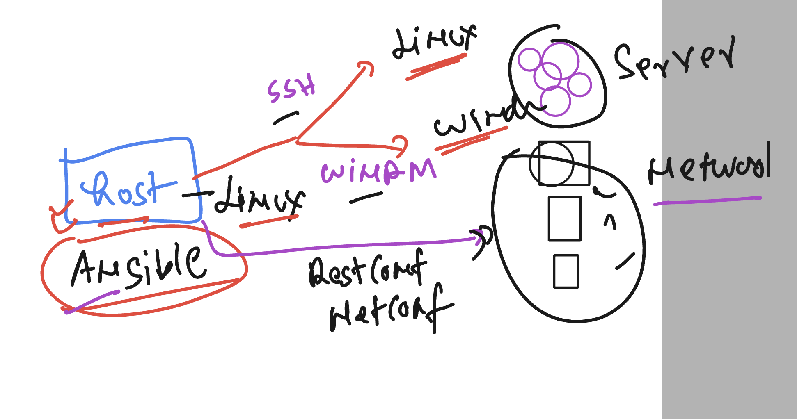
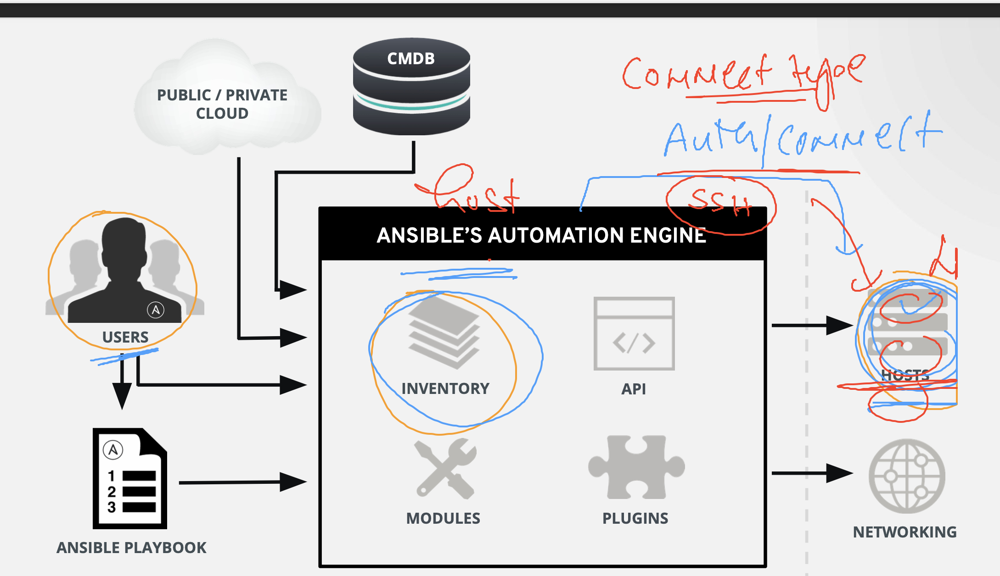

# ansible_wallmart

### for any App or product in IT industry we need IT infra 


### provision vs configuration management 


### more info about Ansible 


### ansible supported things 


### ansible to target 



## lab ENV 

### connecting ansible host using ssh

```
PS C:\Users\humanfirmware> ssh  ashu@44.221.210.170
The authenticity of host '44.221.210.170 (44.221.210.170)' can't be established.
ED25519 key fingerprint is SHA256:et24JX7IyJwvjQSk9j6Cs9AVbOhKzZsmAReQxUEGLaY.
This key is not known by any other names
Are you sure you want to continue connecting (yes/no/[fingerprint])? yes
Warning: Permanently added '44.221.210.170' (ED25519) to the list of known hosts.
ashu@44.221.210.170's password:
   ,     #_
   ~\_  ####_        Amazon Linux 2
  ~~  \_#####\
  ~~     \###|       AL2 End of Life is 2025-06-30.
  ~~       \#/ ___
   ~~       V~' '->
    ~~~         /    A newer version of Amazon Linux is available!
      ~~._.   _/
         _/ _/       Amazon Linux 2023, GA and supported until 2028-03-15.
       _/m/'           https://aws.amazon.com/linux/amazon-linux-2023/

[ashu@ip-172-31-24-203 ~]$ whoami
ashu
[ashu@ip-172-31-24-203 ~]$

```

### Installing ansible on linux host 

```
amazon-linux-extras  install ansible2
Topic ansible2 has end-of-support date of 2023-09-30
Installing ansible
Failed to set locale, defaulting to C
Loaded plugins: extras_suggestions, langpacks, priorities, update-motd
Cleaning repos: amzn2-core amzn2extra-ansible2 amzn2extra-docker amzn2extra-kernel-5.10
17 metadata files removed
6 sqlite files removed
0 metadata files removed
Failed to set locale, defaulting to C
Loaded plugins: extras_suggestions, langpacks, priorities, update-motd
amzn2-core                                                                                                                            | 3.6 kB  00:00:00     
amzn2extra-ansible2                                                                                                                   | 2.9 kB  00:00:00     
amzn2extra-docker                                                                                                                     | 2.9 kB  00:00:00     
amzn2extra-kernel-5.10                                                                                                                | 3.0 kB  00:00:00     
(1/9): amzn2-core/2/x86_64/group_gz                                                                                                   | 2.7 kB  00:00:00     
(2/9): amzn2-core/2/x86_64/updateinfo                                                                                                 | 742 kB  00:00:00     
(3/9): amzn2extra-docker/2/x86_64/primary_db                                                                                          | 104 kB  00:00:00     
(4/9): amzn2extra-kernel-5.10/2/x86_64/updateinfo                                                                                     |  42 kB  00:00:00     
(5/9): amzn2extra-ansible2/2/x86_64/updateinfo                                                                                        | 4.4 kB  00:00:00     
(6/9): amzn2extra-docker/2/x86_64/updateinfo                                                                                          |  13 kB  00:00:00     
(7/9): amzn2extra-ansible2/2/x86_64/primary                                                                                           |  13 kB  00:00:00     
(8/9): amzn2extra-kernel-5.10/2/x86_64/primary_db                                                                                     |  21 MB  00:00:00     
(9/9): amzn2-core/2/x86_64/primary_db                                                                                                 |  68 MB  00:00:00     
Resolving Dependencies
--> Running transaction check
---> Package ansible.noarch 0:2.9.23-1.amzn2 will be installed
--> Processing Dependency: sshpass for package: ansible-2.9.23-1.amzn2.noarch
--> Processing Dependency: python-paramiko for package: ansible-2.9.23-1.amzn2.noarch
--> Processing Dependency: python-keyczar for package: ansible-2.9.23-1.amzn2.noarch
--> Processing Dependency: python-httplib2 for package: ansible-2.9.23-1.amzn2.noarch
--> Processing Dependency: python-crypto for package: ansible-2.9.23-1.amzn2.noarch
--> Running transaction check
---> Package python-keyczar.noarch 0:0.71c-2.amzn2 will be installed
---> Package python2-crypto.x86_64 0:2.6.1-13.amzn2.0.3 will be installed
--> Processing Dependency: libtomcrypt.so.1()(64bit) for package: python2-crypto-2.6.1-13.amzn2.0.3.x86_64
---> Package python2-httplib2.noarch 0:0.18.1-3.amzn2 will be installed
---> Package python2-paramiko.noarch 0:1.16.1-3.amzn2.0.3 will be installed
--> Processing Dependency: python2-ecdsa for package: python2-paramiko-1.16.1-3.amzn2.0.3.noarch
---> Package sshpass.x86_64 0:1.06-1.amzn2.0.1 will be installed
--> Running transaction check
---> Package libtomcrypt.x86_64 0:1.18.2-1.amzn2.0.1 will be installed
--> Processing Dependency: libtommath >= 1.0 for package: libtomcrypt-1.18.2-1.amzn2.0.1.x86_64
--> Processing Dependency: libtommath.so.1()(64bit) for package: libtomcrypt-1.18.2-1.amzn2.0.1.x86_64
---> Package python2-ecdsa.noarch 0:0.13.3-1.amzn2.0.1 will be installed
--> Running transaction check
---> Package libtommath.x86_64 0:1.0.1-4.amzn2.0.2 will be installed
--> Finished Dependency Resolution

Dependencies Resolved

=============================================================================================================================================================
 Package                               Arch                        Version                                    Repository                                Size
=============================================================================================================================================================
Installing:
 ansible                               noarch                      2.9.23-1.amzn2                             amzn2extra-ansible2                       17 M
Installing for dependencies:
 libtomcrypt                           x86_64                      1.18.2-1.amzn2.0.1                         amzn2extra-ansible2                      409 k
 libtommath                            x86_64                      1.0.1-4.amzn2.0.2                          amzn2extra-ansible2                       36 k
 python-keyczar                        noarch                      0.71c-2.amzn2                              amzn2extra-ansible2                      218 k
 python2-crypto                        x86_64                      2.6.1-13.amzn2.0.3            
```

### WE only install ansible in Linux host 


### verify ansible installation --

```
[ashu@ip-172-31-24-203 ~]$ ansible --version
ansible 2.9.23
  config file = /etc/ansible/ansible.cfg
  configured module search path = [u'/home/ashu/.ansible/plugins/modules', u'/usr/share/ansible/plugins/modules']
  ansible python module location = /usr/lib/python2.7/site-packages/ansible
  executable location = /usr/bin/ansible
  python version = 2.7.18 (default, Oct 19 2023, 21:17:03) [GCC 7.3.1 20180712 (Red Hat 7.3.1-17)]
[ashu@ip-172-31-24-203 ~]$


```

### reverify it

```

[ashu@ip-172-31-24-203 ~]$ whoami
ashu
[ashu@ip-172-31-24-203 ~]$ ansible --version
ansible 2.9.23
  config file = /etc/ansible/ansible.cfg
  configured module search path = [u'/home/ashu/.ansible/plugins/modules', u'/usr/share/ansible/plugins/modules']
  ansible python module location = /usr/lib/python2.7/site-packages/ansible
  executable location = /usr/bin/ansible
  python version = 2.7.18 (default, Oct 19 2023, 21:17:03) [GCC 7.3.1 20180712 (Red Hat 7.3.1-17)]
[ashu@ip-172-31-24-203 ~]$
[ashu@ip-172-31-24-203 ~]$
[ashu@ip-172-31-24-203 ~]$ ls
mytarget
[ashu@ip-172-31-24-203 ~]$ cat  mytarget
192.168.100.2
192.168.101.2
[ashu@ip-172-31-24-203 ~]$
```


### testing host to target machine networking connection 

```
 whoami
ashu
[ashu@ip-172-31-24-203 ~]$ ls
mytarget
[ashu@ip-172-31-24-203 ~]$ cat  mytarget
192.168.100.2
192.168.101.2
[ashu@ip-172-31-24-203 ~]$
[ashu@ip-172-31-24-203 ~]$ ping  192.168.100.2
PING 192.168.100.2 (192.168.100.2) 56(84) bytes of data.
64 bytes from 192.168.100.2: icmp_seq=1 ttl=127 time=0.164 ms
64 bytes from 192.168.100.2: icmp_seq=2 ttl=127 time=0.047 ms
^C
--- 192.168.100.2 ping statistics ---
2 packets transmitted, 2 received, 0% packet loss, time 1004ms
rtt min/avg/max/mdev = 0.047/0.105/0.164/0.059 ms
[ashu@ip-172-31-24-203 ~]$ ping  192.168.101.2
PING 192.168.101.2 (192.168.101.2) 56(84) bytes of data.
64 bytes from 192.168.101.2: icmp_seq=1 ttl=127 time=0.052 ms
64 bytes from 192.168.101.2: icmp_seq=2 ttl=127 time=0.048 ms
^C
--- 192.168.101.2 ping statistics ---
2 packets transmitted, 2 received, 0% packet loss, time 1020ms
rtt min/avg/max/mdev = 0.048/0.050/0.052/0.002 ms
```

### Inventroy file -- demo

```
 cat  mytarget
[ashu-group1]
192.168.100.2
192.168.101.2
```

### ansible host to ansible target machine connection type 



### testing ssh connection with ansible host to target machines

```
 [ashu@ip-172-31-24-203 ~]$ ssh   test@192.168.100.2
The authenticity of host '192.168.100.2 (192.168.100.2)' can't be established.
ECDSA key fingerprint is SHA256:yms+Ut10LWBUjqg+VkIKoDGCnI2EwZW5evFBQhRGdUQ.
ECDSA key fingerprint is MD5:12:cc:60:b2:e9:8f:04:9c:82:0e:0b:c4:85:74:72:8e.
Are you sure you want to continue connecting (yes/no)? yes
Warning: Permanently added '192.168.100.2' (ECDSA) to the list of known hosts.
test@192.168.100.2's password:
Last login: Mon Apr 18 17:50:03 2022
[test@centos2 ~]$ exit
logout
Connection to 192.168.100.2 closed.
[ashu@ip-172-31-24-203 ~]$ ssh   test@192.168.101.2
The authenticity of host '192.168.101.2 (192.168.101.2)' can't be established.
ECDSA key fingerprint is SHA256:yms+Ut10LWBUjqg+VkIKoDGCnI2EwZW5evFBQhRGdUQ.
ECDSA key fingerprint is MD5:12:cc:60:b2:e9:8f:04:9c:82:0e:0b:c4:85:74:72:8e.
Are you sure you want to continue connecting (yes/no)? yes
Warning: Permanently added '192.168.101.2' (ECDSA) to the list of known hosts.
test@192.168.101.2's password:
Last login: Mon Apr 18 17:50:03 2022
[test@fedora2 ~]$ exit
logout
```

### ansible to target connection in case of linux hosts


### running first instruction to both the linux target machines 

```
 ansible  -i mytarget  ashu-group1  -u test -k  -a  "date"
SSH password:
[WARNING]: Invalid characters were found in group names but not replaced, use -vvvv to see details
192.168.101.2 | CHANGED | rc=0 >>
Mon Dec  4 11:09:39 UTC 2023
192.168.100.2 | CHANGED | rc=0 >>
Mon Dec  4 11:09:39 UTC 2023
```

### ansible command explain


### ansible default inventry file --- /etc/ansible/hosts 

```
cd  /etc/ansible/
[root@ip-172-31-24-203 ansible]# ls
ansible.cfg  hosts  roles
[root@ip-172-31-24-203 ansible]# 
```

## Note:  group names is going be searched in default inventory file that is /etc/ansible/hosts

```
[ashu@ip-172-31-24-203 ~]$ ansible   walmart  -u test  -k  -a "date"
SSH password:
192.168.101.20 | CHANGED | rc=0 >>
Mon Dec  4 11:31:39 UTC 2023
192.168.100.20 | CHANGED | rc=0 >>
Mon Dec  4 11:31:39 UTC 2023
[ashu@ip-172-31-24-203 ~]$
[ashu@ip-172-31-24-203 ~]$


[ashu@ip-172-31-24-203 ~]$ ansible  all  -u test  -k  -a "date"
SSH password:
192.168.100.20 | CHANGED | rc=0 >>
Mon Dec  4 11:31:58 UTC 2023
192.168.101.20 | CHANGED | rc=0 >>
Mon Dec  4 11:31:58 UTC 2023
192.168.100.19 | CHANGED | rc=0 >>
Mon Dec  4 11:31:58 UTC 2023
192.168.101.19 | CHANGED | rc=0 >>
Mon Dec  4 11:31:58 UTC 2023
```

### understanding of modules in ansible 


### as per target of systems they have designed the modules 

```
  23  ansible-doc  -l
   24  ansible-doc  -l   |   grep command

```

### using ping module to check  connection to linux target types

```
 ansible  all -m ping  -u test -k
SSH password:
192.168.101.20 | SUCCESS => {
    "ansible_facts": {
        "discovered_interpreter_python": "/usr/bin/python3"
    },
    "changed": false,
    "ping": "pong"
}
192.168.100.19 | SUCCESS => {
    "ansible_facts": {
        "discovered_interpreter_python": "/usr/bin/python3"
    },
```

### using command module 

```
 ansible  all  -u test -k  -m command  -a  "whoami"
SSH password:
192.168.100.20 | CHANGED | rc=0 >>
test
192.168.100.19 | CHANGED | rc=0 >>
test
192.168.101.20 | CHANGED | rc=0 >>
test
192.168.101.19 | CHANGED | rc=0 >>
test
```

### replacing password based auth to key based auth 

```
[ashu@ip-172-31-24-203 ~]$ whoami
ashu
[ashu@ip-172-31-24-203 ~]$ ssh-keygen
Generating public/private rsa key pair.
Enter file in which to save the key (/home/ashu/.ssh/id_rsa):
Enter passphrase (empty for no passphrase):
Enter same passphrase again:
Your identification has been saved in /home/ashu/.ssh/id_rsa.
Your public key has been saved in /home/ashu/.ssh/id_rsa.pub.
The key fingerprint is:
SHA256:PZtQkb7FIdWi5nonZwKBB+in1T9Gn/X7y3mbziwqFXc ashu@ip-172-31-24-203.ec2.internal
The key's randomart image is:
+---[RSA 2048]----+
|     .    .o..   |
|    . .   o.o .  |
|   .   + ..+ o   |
|    . + +o=.o..E |
|     + .S*o+oo.. |
|    .   ..*=o   .|
|         ++.    .|
|        ..+ +.+.+|
|         ..B. oX*|
+----[SHA256]-----+
```

########

### transfer public key to all the target host

```
  38  ssh-copy-id   test@192.168.100.2
   39  ssh-copy-id   test@192.168.101.2
   40  history
   41  ssh-copy-id   test@192.168.101.19
   42  ssh-copy-id   test@192.168.100.19
   43  ssh-copy-id   test@192.168.100.20
   44  ssh-copy-id   test@192.168.101.20
```

### running date command in all the groups of default inventroy 

```
 ansible  all  -u test  -m command -a "date"
192.168.100.19 | CHANGED | rc=0 >>
Mon Dec  4 12:15:03 UTC 2023
192.168.101.19 | CHANGED | rc=0 >>
Mon Dec  4 12:15:03 UTC 2023
192.168.100.20 | CHANGED | rc=0 >>
Mon Dec  4 12:15:03 UTC 2023
192.168.101.20 | CHANGED | rc=0 >>
Mon Dec  4 12:15:03 UTC 2023
```

### custom ansible config and inventory file 

```
[ashu@ip-172-31-24-203 ~]$ ls
ansible.cfg  mytarget
[ashu@ip-172-31-24-203 ~]$ cat  mytarget
[ashu-group1]
192.168.100.2
192.168.101.2
[ashu@ip-172-31-24-203 ~]$ cat  ansible.cfg

# first part is default section

[defaults]
inventory = /home/ashu/mytarget
remote_user = test
[ashu@ip-172-31-24-203 ~]$
[ashu@ip-172-31-24-203 ~]$ ansible  all  -m ping
[WARNING]: Invalid characters were found in group names but not replaced, use -vvvv to see details
192.168.100.2 | SUCCESS => {
    "ansible_facts": {
        "discovered_interpreter_python": "/usr/bin/python3"
    },
    "changed": false,
    "ping": "pong"
}
192.168.101.2 | SUCCESS => {
    "ansible_facts": {
        "discovered_interpreter_python": "/usr/bin/python3"
    },
    "changed": false,
    "ping": "pong"
}
```

### more understanding 

```
[ashu@ip-172-31-24-203 ~]$ ls
ansible.cfg  mytarget
[ashu@ip-172-31-24-203 ~]$ cat mytarget
[ashu-group1]
192.168.100.2
192.168.101.2
[ashu@ip-172-31-24-203 ~]$ cat ansible.cfg

# first part is default section

[defaults]
inventory = /home/ashu/mytarget
remote_user = test
[ashu@ip-172-31-24-203 ~]$
[ashu@ip-172-31-24-203 ~]$
[ashu@ip-172-31-24-203 ~]$ ansible all  -m command -a "whoami"
[WARNING]: Invalid characters were found in group names but not replaced, use -vvvv to see details
192.168.101.2 | CHANGED | rc=0 >>
test
192.168.100.2 | CHANGED | rc=0 >>
test
```


