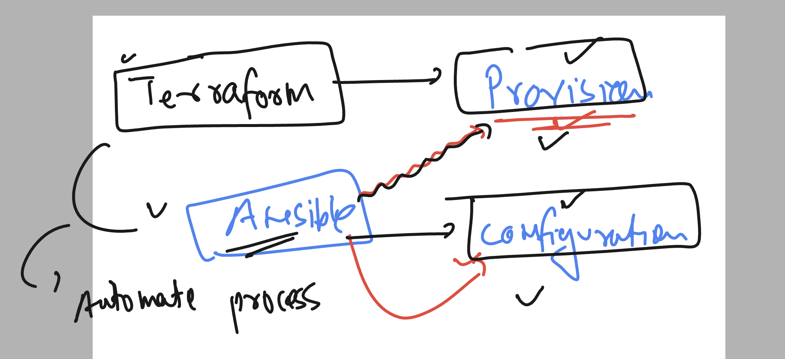
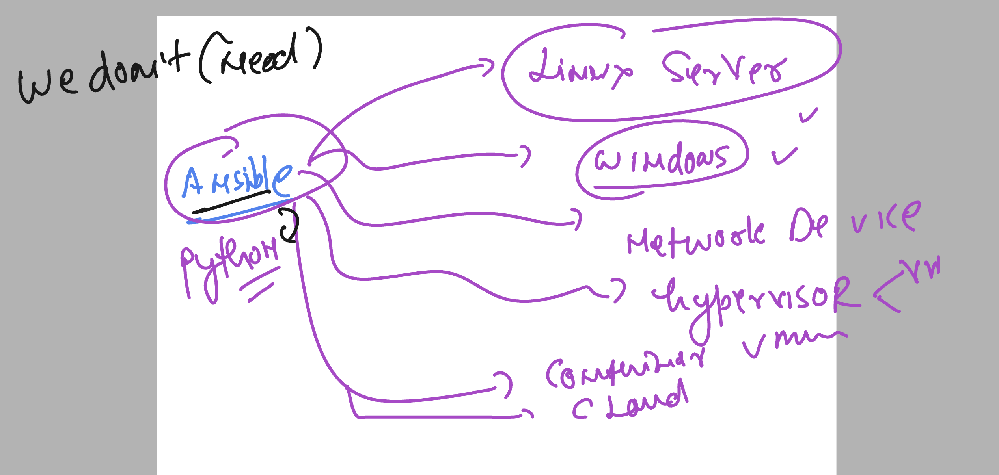

# ansible_wallmart

### for any App or product in IT industry we need IT infra 


### provision vs configuration management 



### more info about Ansible 


### ansible supported things 



### ansible to target 


## lab ENV 

### connecting ansible host using ssh

```
PS C:\Users\humanfirmware> ssh  ashu@44.221.210.170
The authenticity of host '44.221.210.170 (44.221.210.170)' can't be established.
ED25519 key fingerprint is SHA256:et24JX7IyJwvjQSk9j6Cs9AVbOhKzZsmAReQxUEGLaY.
This key is not known by any other names
Are you sure you want to continue connecting (yes/no/[fingerprint])? yes
Warning: Permanently added '44.221.210.170' (ED25519) to the list of known hosts.
ashu@44.221.210.170's password:
   ,     #_
   ~\_  ####_        Amazon Linux 2
  ~~  \_#####\
  ~~     \###|       AL2 End of Life is 2025-06-30.
  ~~       \#/ ___
   ~~       V~' '->
    ~~~         /    A newer version of Amazon Linux is available!
      ~~._.   _/
         _/ _/       Amazon Linux 2023, GA and supported until 2028-03-15.
       _/m/'           https://aws.amazon.com/linux/amazon-linux-2023/

[ashu@ip-172-31-24-203 ~]$ whoami
ashu
[ashu@ip-172-31-24-203 ~]$

```


