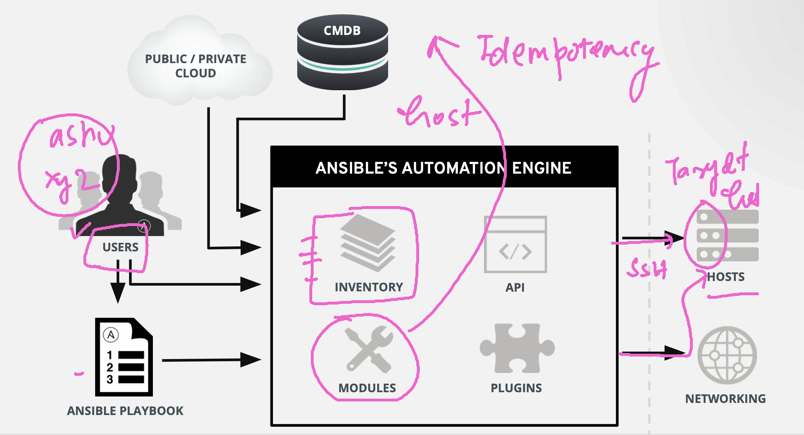

# ansible_wallmart

### Revision 



### lab connection testing 

```
~ ssh ashu@44.221.210.170                                 
ashu@44.221.210.170's password: 
Last login: Tue Dec  5 08:42:51 2023 from 182.71.40.162
   ,     #_
   ~\_  ####_        Amazon Linux 2
  ~~  \_#####\
  ~~     \###|       AL2 End of Life is 2025-06-30.
  ~~       \#/ ___
   ~~       V~' '->
    ~~~         /    A newer version of Amazon Linux is available!
      ~~._.   _/
         _/ _/       Amazon Linux 2023, GA and supported until 2028-03-15.
       _/m/'           https://aws.amazon.com/linux/amazon-linux-2023/

12 package(s) needed for security, out of 13 available
Run "sudo yum update" to apply all updates.
-bash: warning: setlocale: LC_CTYPE: cannot change locale (UTF-8): No such file or directory
[ashu@ip-172-31-24-203 ~]$ 
[ashu@ip-172-31-24-203 ~]$ 
[ashu@ip-172-31-24-203 ~]$ whoami
ashu
[ashu@ip-172-31-24-203 ~]$ ansible --version 
ansible 2.9.23
  config file = /home/ashu/ansible.cfg
  configured module search path = [u'/home/ashu/.ansible/plugins/modules', u'/usr/share/ansible/plugins/modules']
  ansible python module location = /usr/lib/python2.7/site-packages/ansible
  executable location = /usr/bin/ansible
  python version = 2.7.18 (default, Oct 19 2023, 21:17:03) [GCC 7.3.1 20180712 (Red Hat 7.3.1-17)]
[ashu@ip-172-31-24-203 ~]$ 


```

### labs details 

```
whoami
ashu
[ashu@ip-172-31-24-203 ~]$ pwd
/home/ashu
[ashu@ip-172-31-24-203 ~]$ ls
ansible.cfg  inventory
[ashu@ip-172-31-24-203 ~]$ cat  ansible.cfg 

# first part is default section

[defaults]
inventory = /home/ashu/inventory
remote_user = test
[ashu@ip-172-31-24-203 ~]$ 

```

### generating key-pair for ssh connection 

```
 ssh-keygen 
Generating public/private rsa key pair.
Enter file in which to save the key (/home/ashu/.ssh/id_rsa): 
/home/ashu/.ssh/id_rsa already exists.
Overwrite (y/n)? y
Enter passphrase (empty for no passphrase): 
Enter same passphrase again: 
Your identification has been saved in /home/ashu/.ssh/id_rsa.
Your public key has been saved in /home/ashu/.ssh/id_rsa.pub.
The key fingerprint is:
SHA256:cBWwsxXNUULI+YtFYPSBGcSrijHJQNIcwyHVvN95bFQ ashu@ip-172-31-24-203.ec2.internal
The key's randomart image is:
+---[RSA 2048]----+
|.===    .*X%=o.  |
|..=.o    +BoEo   |
| o   .. + .=.    |
|  . .  o +o o    |
|   o o .S= o .   |
|    = . + = .    |
|     + . o       |
|    . .          |
|                 |
+----[SHA256]-----+

```

### copy key in inventory target 

```
 144  ssh-copy-id      test@192.168.100.2
  145  ssh-copy-id      test@192.168.101.2
```

### testing connection between ansible and target machines 

```
[ashu@ip-172-31-24-203 ~]$ ls
ansible.cfg  inventory
[ashu@ip-172-31-24-203 ~]$ cat  ansible.cfg 

# first part is default section

[defaults]
inventory = /home/ashu/inventory
remote_user = test

[ashu@ip-172-31-24-203 ~]$ cat  inventory 
[ashu-server]
192.168.100.2
192.168.101.2


[ashu@ip-172-31-24-203 ~]$ ansible  ashu-server  -m ping -u test
[WARNING]: Invalid characters were found in group names but not replaced, use -vvvv to see details
192.168.100.2 | SUCCESS => {
    "ansible_facts": {
        "discovered_interpreter_python": "/usr/bin/python3"
    }, 
    "changed": false, 
    "ping": "pong"
}
192.168.101.2 | SUCCESS => {
    "ansible_facts": {
        "discovered_interpreter_python": "/usr/bin/python3"
    }, 
    "changed": false, 
    "ping": "pong"
}

```
